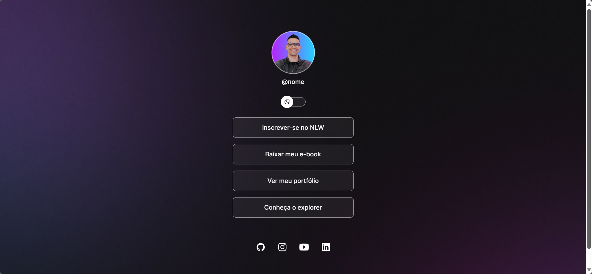

# DevLinks

Programa exclusivo e gratuito, promovido pela RocketSeat para ensino de tecnologias WEB. 

>Trilha Discover

<h1> Projeto construido na Next Level Week da Rocketseat </h1>

## Projeto
O DevLinks é um agregador de links para usar como cartão de visitas online

## Tecnologias
- HTML
- CSS
- JavaScript
- Git e Github
- Figma

## Aprendizado Adquirido
Durante o desenvolvimento deste projeto, adquiri conhecimento e pratiquei os seguintes conceitos e técnicas:
- Estruturação de Páginas Web: Aprendi a utilizar tags HTML para criar uma estrutura básica para a página web, incluindo cabeçalho, corpo e rodapé.
- Estilização com CSS: Pratiquei a aplicação de estilos CSS para formatar o layout da página, incluindo cores, fontes, margens e paddings.
- Interatividade com JavaScript: Aprendi a utilizar JavaScript para manipular elementos HTML dinamicamente, como adicionar e remover elementos do DOM e responder a eventos do usuário, como cliques e submissões de formulários.
